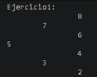
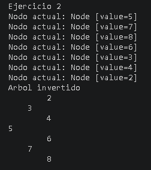
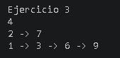
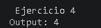

# Estructuras no lineales 
### Nombre
 - Jose Luis Vega Pesantez

 ## Descripcion general:
 - Esta es una práctica de estructura de datos que esta enfocada en el uso y recorrido de Árboles Binarios en Java. El objetivo fue aprender la lógica detrás de estas estructuras mediante punteros y recursividada.

 ## Explicacion ejercicio 1
 - Este ejercicio recibe un arreglo de números desordenados y los mete dentro de un Árbol Binario. Para lograrlo, recorro el arreglo con un bucle for y voy insertando cada número uno por uno usando el método .add(). Si el número es menor va a la izquierda y si es mayor va a la derecha. Al final, uso un método recursivo auxiliar para imprimir el árbol de manera horizontal.

  ## Explicacion ejercicio 2
  - El objetivo de este ejercico es voltear lo q hicimos en el ejercicio 1. Usaremos el método que usa recursión. Primero validando un caso base: si el nodo actual es nulo, se detiene. Si tiene datos, uso una variable temporal para guardar el nodo izquierdo, luego muevo lo de la derecha a la izquierda, y lo que guardé en la variable temporal y lo pongo en la derecha. Una vez hecho este intercambio en el nodo actual, el método se vuelve a llamar a sí mismo para hacer lo mismo con los hijos izquierda y derecha hasta voltear todo el árbol.

  ## Explicacion ejercicio 3
- Este algoritmo agrupa los nodos del árbol dependiendo del nivel en la que se encuentren. Utilicé un recorrido en anchura apoyándome en una estructura de Cola. El método mide cuántos elementos hay en la cola al inicio de cada nivel; y con el tamaño, procesa exactamente esos nodos mediante un ciclo, los guarda en una lista  para ese nivel, y pone a sus respectivos hijos en la cola para que sean procesados en el siguiente paso. Al final, devuelve una lista que contiene las sublistas de cada nivel.

## Explicacion ejercicio 4
- Este método calcula la longitud del camino más largo desde la raíz hasta la hoja q esta mas lejos. Y si el nodo que está comparando es nulo, devuelve 0. Si no es nulo, calcula por separado la profundidad que esta a la izquierdo y la de su lado derecho. Al final, usando Math.max(), compara ambos resultados, elige el camino que sea más largo y le suma 1 para obtener la altura total real.

## MARKDOWN DE LOS CODIGOS DESARROLLADOS 
### CODIGO DE EJERCICIO 1
``` package trees;

import structures.node.Node;

public class Ejercicio1 {
    public void insert(int[] numeros){
        //Crear arbol de enteros
        //Insertar cada numero
        // imprimir el arbol

        BinaryTree<Integer> tree = new BinaryTree<>();
        for(int numero : numeros ){
              tree.add(numero);
            
        }
        printTree(tree.getRoot());

        
    }

    private void printTree(Node<Integer> root) {
       // System.out.println("imprimiendo el arbol");
        printTreeRecursivo(root, 0);
    }

    private void printTreeRecursivo(Node<Integer> actual, int nivel) {
       if(actual== null ) return;
       printTreeRecursivo(actual.getRight(),nivel+1);

       for(int  i=0 ; i< nivel;i++){
       System.out.print("\t");
       }
       System.out.println(actual.getValue());
       printTreeRecursivo(actual.getLeft(), nivel+1 );

       
    }

} 
```

### CODIGO DE EJERCICIO 2

``` package trees;


import structures.node.Node;

public class Ejercicio2 {

    public static void invertTree(Node<Integer> actual) {
        
    if (actual == null) {
            return;
        }

        System.out.println("Nodo actual: " + actual);

       
        Node<Integer> temp = actual.getLeft();

        actual.setLeft(actual.getRight());
        actual.setRight(temp);

        invertTree(actual.getLeft());
        invertTree(actual.getRight());


    }
    public static void imprimirArbolInvertido(Node<Integer> actual) {
    imprimirInvertidoRecursivo(actual, 0);
}

    private static void imprimirInvertidoRecursivo(Node<Integer> actual, int nivel) {
    if (actual == null) {
        return;
    }
    imprimirInvertidoRecursivo(actual.getRight(), nivel + 1);

    for (int i = 0; i < nivel; i++) {
        System.out.print("    "); 
    }
    System.out.println(actual.getValue());

    imprimirInvertidoRecursivo(actual.getLeft(), nivel + 1);
}
    
}
```
### CODIGO DE EJERCICIO 3
  ```package trees;

import java.util.ArrayList;
import java.util.LinkedList;
import java.util.List;
import java.util.Queue;
import structures.node.Node;
public class Ejercicio3 {
    public List<List<Node<Integer>>> listLevels(Node<Integer> root) {
        
        List<List<Node<Integer>>> resultado = new ArrayList<>();
        
        
        if (root == null) {
            return resultado;
        }

        
        Queue<Node<Integer>> cola = new LinkedList<>();
        cola.add(root);

        while (!cola.isEmpty()) {
          
            int nodosEnNivel = cola.size();
            List<Node<Integer>> nivelActual = new ArrayList<>();

           
            for (int i = 0; i < nodosEnNivel; i++) {
                Node<Integer> nodoActual = cola.poll(); 
                nivelActual.add(nodoActual);            

                
                if (nodoActual.getLeft() != null) {
                    cola.add(nodoActual.getLeft());
                }
                
                if (nodoActual.getRight() != null) {
                    cola.add(nodoActual.getRight());
                }
            }

            
            resultado.add(nivelActual);
        }

        return resultado;
    }
}
```

### CODIGO DE EJERCICIO 4

```package trees;

import structures.node.Node;
public class Ejercicio4 {
    public int maxDepth(Node<Integer> root) {
        
        if (root == null) {
            return 0;
        }        
        int depthIzquierdo = maxDepth(root.getLeft());
        int depthDerecho = maxDepth(root.getRight());
        return Math.max(depthIzquierdo, depthDerecho) + 1;
    }
}
```
## Salida de consola 
### salida de consola 1

### salida de consola 2

### salida de consola 3

### salida de consola 4


## URL repositorio 
https://github.com/jv782733-ops/icc-est-u2-estNoLineales.git